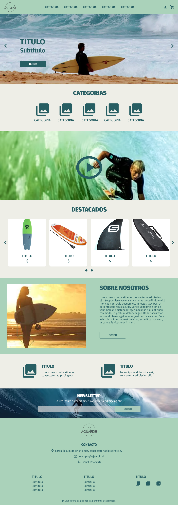
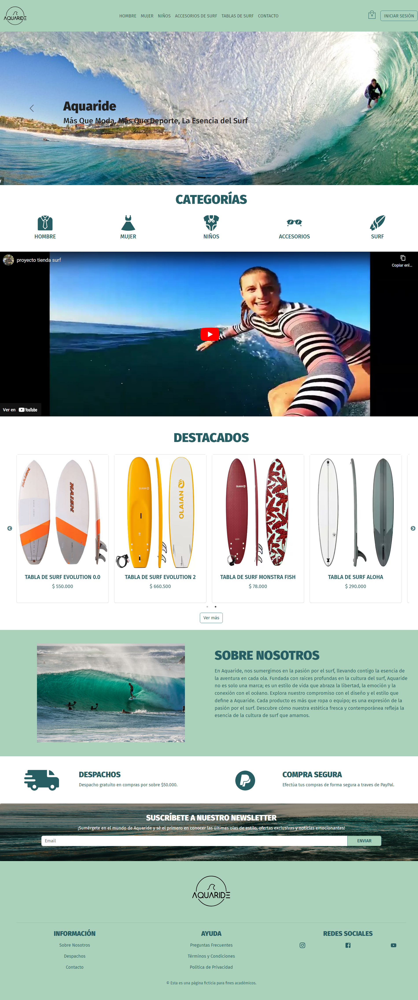

Proyecto 5: E-commerce
# Aquaride

## **Descripción:**
El proyecto se enfoca en el desarrollo de una aplicación E-commerce con rutas de home, login/registro, perfil, listado de productos, producto individual, carrito y pasarela de pago; además de desarrollar el backend que se conectará con el front.

Este proyecto fue realizado en un grupo de 4 personas:  
Tania Bobadilla, Ignacio Gomez, Rodrigo Velasquez y Fernanda Ramirez 

**Repositorio Backend del proyecto:** 
https://github.com/Tania-Bobadilla/Ecommerce-backend

Primero se diseñó un prototipo visual simple de la aplicación.

Versión Final:

## **Features:**
Para el desarrollo del proyecto se utilizaron diferentes tecnologías, tales como:

### **Diseño**
- Aplicación Figma: Para el desarrollo del diseño inicial de la página web.

### **UI**
- React Bootstrap: Incorporación de variados componentes del framework para agilizar el desarrollo del prototipo.
- React Slick: Carousel personalizado.
- Material Icons: Para la incorporación de íconos.
- Flaticon: Descarga de algunos íconos.
- Unsplash: Imágenes.

### **Desarrollo**
**Front-End**
- Vite: Para la creación del entorno de desarrollo.
- React: Para trabajar la UI en base a componentes.
- React Router: Crear y gestionar rutas dinámicas.
- Axios: Manejo de operaciones HTTP.

**Back-End**
- MongoDB: Base de datos.
- ExpressJS: Desarrollo del backend con Node.js.

## **Objetivos:**
El enfoque principal del proyecto es desarrollar una aplicación web, tanto el Front como el Back, para lo cual se plantean los siguientes objetivos:

**Front**
1. Manejo de rutas.
2. Manejo de estados locales y globales.

**Back**
1. Manejo de rutas en un servidor.
2. Gestión y flujo de datos en MongoDB.
3. Seguridad (Autenticación y autorización).

## **Demo:**
A continuación, se presenta un enlace a la demo del proyecto.

https://fabulous-genie-b3ac69.netlify.app/
